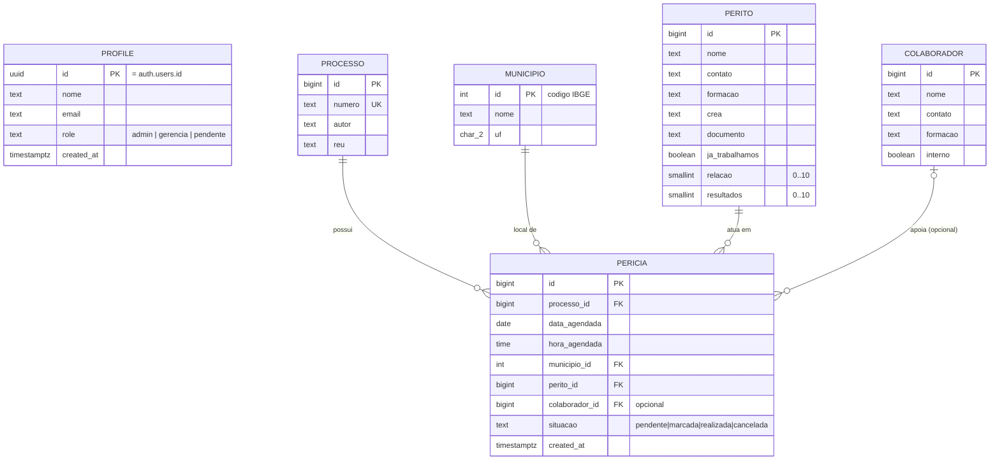

# Design — SaaS de Gestão de Perícias

Data: 2026-07-26

## 1. Visão geral

Sistema web para cadastrar e gerenciar perícias, os processos aos quais elas se
vinculam, e as pessoas envolvidas (peritos e colaboradores). Foco principal é a
tela de listagem de perícias e o cadastro de perícia vinculado a um processo.

## 2. Stack e hospedagem (custo zero)

- **Next.js 15** (App Router, TypeScript) — front-end e back-end (Server
  Actions + Route Handlers) no mesmo projeto.
- **Vercel** (free tier) — hospedagem do app Next.js.
- **Supabase** (free tier) — Postgres gerenciado + autenticação (Google OAuth
  e e-mail/senha) + Row Level Security.
- **Tailwind CSS + shadcn/ui** — componentes de UI (tabela, tooltip, sidebar,
  formulários, modais, combobox).
- **Zod** — validação, compartilhada entre formulários (client) e server
  actions (server).
- **Vitest + Testing Library** — testes de regras de negócio e formulários
  críticos.
- **Municípios**: autocomplete client-side consultando a API pública do IBGE
  (`servicodados.ibge.gov.br`). Ao selecionar um município, o registro
  (código IBGE, nome, UF) é gravado/upsert na tabela local `municipio` — a
  listagem de perícias nunca depende da API externa em runtime.

## 3. Modelo de dados

### 3.1 Diagrama

### 3.2 Regras de integridade

- `processo.numero` é `UNIQUE NOT NULL`.
- `pericia.processo_id`, `pericia.municipio_id`, `pericia.perito_id`:
  `NOT NULL`, `REFERENCES ... ON DELETE RESTRICT` (não é possível apagar um
  processo, município ou perito que tenha perícias vinculadas).
- `pericia.colaborador_id`: `NULL` permitido, `ON DELETE SET NULL`.
- `pericia.situacao`: enum Postgres (`pendente`, `marcada`, `realizada`,
  `cancelada`), default `pendente`.
- `perito.relacao` e `perito.resultados`: `smallint CHECK (valor BETWEEN 0 AND
  10)`.
- `profile.role`: enum Postgres (`admin`, `gerencia`, `pendente`), default
  `pendente`.
- Migrations SQL versionadas no repo via Supabase CLI; nenhuma alteração de
  schema feita manualmente pelo dashboard em produção.

## 4. Autenticação e perfis

- Login via **Google OAuth** (Supabase Auth) e via **e-mail/senha** (usado
  pelo admin de teste).
- No primeiro login (qualquer método), um registro `profile` é criado
  automaticamente com `role = 'pendente'` — sem acesso a nenhuma tela além de
  uma página de "aguardando aprovação". Só um Admin pode promover o usuário a
  `gerencia` ou `admin` na tela `/perfis`.
- **Admin**: acesso total (perícias, processos, peritos, colaboradores) +
  tela de controle de perfis (promover/rebaixar usuários).
- **Gerência**: acesso total de CRUD em perícias, processos, peritos e
  colaboradores; **sem** acesso à tela de perfis.
- Permissões aplicadas em duas camadas (defesa em profundidade):
  1. Middleware/guards no Next.js (bloqueia rotas e esconde itens da sidebar).
  2. Row Level Security no Postgres (bloqueia a query mesmo se a camada de
     aplicação falhar).
- Seed de teste: usuário `admin@admin.com` / senha `admin123`, role `admin`
  (Supabase exige mínimo de 6 caracteres na senha, por isso não é possível
  usar literalmente "admin" como senha).

## 5. Telas (rotas, acessíveis via sidebar)

| Rota | Tela | Observações |
|---|---|---|
| `/login` | Login | Botão "Entrar com Google" + formulário e-mail/senha |
| `/pendente` | Aguardando aprovação | Exibida a usuários com role `pendente` |
| `/` | **Listagem de perícias** (home) | Ver §5.1 |
| `/pericias/nova` | Cadastro de perícia | Ver §5.2 |
| `/pericias/[id]` | Edição de perícia | Mesmo formulário do cadastro, pré-preenchido |
| `/peritos` | Listagem de peritos | Tabela simples com busca |
| `/peritos/novo`, `/peritos/[id]` | Cadastro/edição de perito | |
| `/colaboradores` | Listagem de colaboradores | Tabela simples com busca |
| `/colaboradores/novo`, `/colaboradores/[id]` | Cadastro/edição de colaborador | |
| `/perfis` | Controle de perfis | Somente Admin; lista usuários e permite alterar role |

### 5.1 Listagem de perícias (tela principal)

Colunas da tabela, cada uma com tooltip mostrando informações adicionais ao
passar o mouse:

| Coluna | Conteúdo | Tooltip mostra |
|---|---|---|
| Nº Processo | `processo.numero` | Autor × Réu |
| Data – Hora | `data_agendada` + `hora_agendada` | — |
| Local | `municipio.nome`/`uf` | — |
| Perito | `perito.nome` | Contato, formação, CREA, "já trabalhamos", relação, resultados |
| Colaborador | `colaborador.nome` (ou "—") | Contato, formação, interno/externo |
| Situação | badge colorida | — |

Recursos: busca por número de processo, filtro por situação, ordenação por
data. Clique na linha abre a edição da perícia.

### 5.2 Cadastro de perícia

Formulário com:
- **Processo**: `combobox` (shadcn Command) buscando entre processos
  existentes por número/autor/réu, **+ botão "Novo processo"** que abre um
  modal com o formulário de processo (número, autor, réu); ao salvar, o
  processo criado é automaticamente selecionado no combobox.
- **Município**: combobox com autocomplete na API do IBGE (debounce),
  grava/upsert local ao selecionar.
- **Perito**: select (dados já cadastrados).
- **Colaborador**: select opcional.
- **Data agendada**, **Hora agendada**, **Situação** (select com as 4
  opções).

### 5.3 Cadastro de perito

Campos: Nome, Contato, Formação, CREA, Documento, "Já trabalhamos" (switch),
Relação (slider/select 0–10), Resultados (slider/select 0–10).

### 5.4 Cadastro de colaborador

Campos: Nome, Contato, Formação, Interno (switch sim/não).

### 5.5 Controle de perfis

Lista de usuários (`profile`) com e-mail, nome, role atual e select para
alterar role (`pendente`/`gerencia`/`admin`). Somente Admin acessa; tentativa
de acesso por outro perfil redireciona para `/`.

## 6. Estrutura de código

- Organização por feature: `features/pericias`, `features/processos`,
  `features/peritos`, `features/colaboradores`, `features/perfis`,
  `features/auth`, cada uma com seus componentes, schemas Zod, server actions
  e testes.
- `lib/supabase` para clients (browser/server) e tipos gerados do banco.
- `lib/ibge` para o client da API de municípios.
- Componentes de UI genéricos em `components/ui` (shadcn) e
  `components/shared` (ex.: `DataTable` com tooltip, `Sidebar`).
- Schemas Zod como única fonte de validação, reaproveitados entre formulário
  e server action.
- Testes com Vitest/Testing Library cobrindo: schemas de validação, regras de
  transição de situação da perícia, formulário de cadastro de perícia
  (processo novo vs. existente), guards de permissão.

## 7. Fora de escopo (YAGNI para esta fase)

- Anexos/documentos de perícia (laudos, fotos).
- Notificações (e-mail/push) de agendamento.
- Relatórios/exportação (PDF, Excel).
- Múltiplas organizações/multi-tenant.

Esses itens podem virar specs futuras se necessário.
